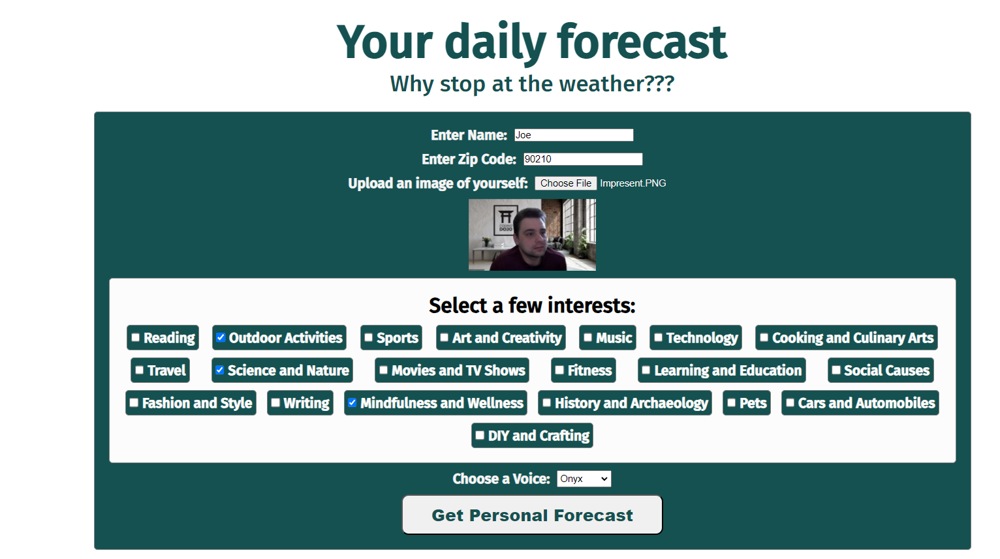
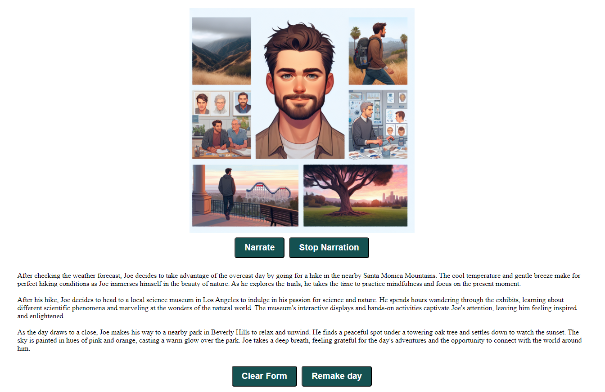

<h1>Daily Forecast</h1>

 

    When you need a little more inspiration than what the weathers like, turn a boring day into an adventure in your own town, or on vacation! All you really need is a name, zip code, and list of interests and it does the work for you. 

<!-- ABOUT THE PROJECT -->
## About The Project

This application uses a zip code, image upload, and a questionaire to create a custom forecast of todays activities. Use it to find inspiration for the day, or just to enertain the idea well staying in the comfort of your home. 

<!-- GETTING STARTED -->
## Getting Started

This project uses a simple html file. Just open it in any browser. You'll have to enter your OpenAI API key in the code provided.

### Prerequisites

To use the FutureForecast you simply need a browser and an OpenAI API key. 

### Installation

1. Get a free API Key from OpenAI
2. Clone the repo
4. Insert your key from OpenAI into the script.js
5. Let the adventure begin!

(<a href="#readme-top">back to top</a>)

<!-- USAGE EXAMPLES -->
## Usage
Just have fun! We do not take resposibility for any wacky adventures you may encounter!🤣

(<a href="#readme-top">back to top</a>)

<!-- CONTRIBUTING -->
## Contributing

Contributions are what make the open source community such an amazing place to learn, inspire, and create. Any contributions you make are **greatly appreciated**.

If you have a suggestion that would make this better, please fork the repo and create a pull request. You can also simply open an issue with the tag "enhancement".
Don't forget to give the project a star! Thanks again!

1. Fork the Project
2. Create your Feature Branch (`git checkout -b feature/AmazingFeature`)
3. Commit your Changes (`git commit -m 'Add some AmazingFeature'`)
4. Push to the Branch (`git push origin feature/AmazingFeature`)
5. Open a Pull Request

(<a href="#readme-top">back to top</a>)

